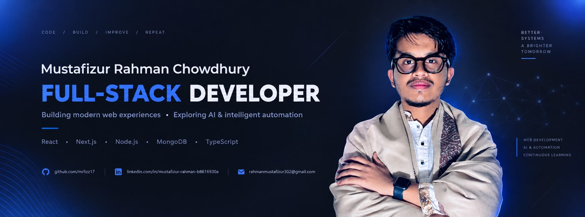

<h1 align="center">Hi 👋, I'm Mustafizur Rahman</h1>
<h3 align="center">Junior Software Engineer</h3>

  

## 👨‍💻 About Me

I'm a Computer Science student focused on full-stack web development. I enjoy building practical applications, solving programming problems, and learning how modern software systems are designed and built.

Currently, I'm strengthening my skills in React, Next.js, TypeScript, Node.js, Express.js, and databases, while exploring better software architecture and AI-powered applications.

🎓 Computer Science Student
💻 Focused on Full-Stack Development
🌱 Currently learning Next.js, TypeScript & Backend Development
🧩 Practicing Data Structures & Algorithms
🚀 Building and deploying real-world projects
🎯 Long-term goal: Full-Stack Engineer → AI-powered application development

##🚀 Featured Projects

#🏋️ FitLog — Fitness & Workout Platform

A modern fitness application for discovering exercises and managing personal workout plans.

Tech: Next.js · TypeScript · React · Tailwind CSS · REST API

🔗[Live Demo](https://fit-log-project-three.vercel.app/)

#🧩 Explore the Technologies

An interactive technology-stack application where users can explore technologies across different categories and build their ideal development stack.

Tech: React · JavaScript · Tailwind CSS · DaisyUI

🔗 [Live Demo](https://techstack-project-mustafiz.netlify.app/)

💻 Currently
→ Building full-stack web applications
→ Deepening Next.js & TypeScript
→ Improving backend & database skills
→ Practicing Data Structures & Algorithms
→ Learning software architecture & system design
→ Exploring AI-powered applications

## 📊 GitHub Stats & Trophies

  
  

  

## 🛠️ Languages & Tools

<h3 align="center">Programming Languages</h3>

  &nbsp;&nbsp;&nbsp;
  &nbsp;&nbsp;&nbsp;
  &nbsp;&nbsp;&nbsp;
  

<h3 align="center">Frontend</h3>

  &nbsp;&nbsp;&nbsp;
  &nbsp;&nbsp;&nbsp;
  &nbsp;&nbsp;&nbsp;
  &nbsp;&nbsp;&nbsp;
  &nbsp;&nbsp;&nbsp;
  

<h3 align="center">Backend</h3>

  &nbsp;&nbsp;&nbsp;
  

<h3 align="center">Database</h3>

  &nbsp;&nbsp;&nbsp;
  

<h3 align="center">Tools</h3>

  &nbsp;&nbsp;&nbsp;
  &nbsp;&nbsp;&nbsp;
  &nbsp;&nbsp;&nbsp;
  &nbsp;&nbsp;&nbsp;
  

  

## 🔗 Connect with Me

  &nbsp;&nbsp;
  

## 💬 Quote
> Always open to feedback, code reviews, and technical discussions.

<picture>
  <source media="(prefers-color-scheme: dark)" srcset="https://raw.githubusercontent.com/cyprieng/github-breakout/main/example/dark.svg" />
  <source media="(prefers-color-scheme: light)" srcset="https://raw.githubusercontent.com/cyprieng/github-breakout/main/example/light.svg" />
  
</picture>

  

